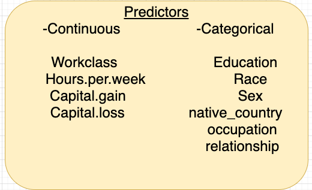

# Adult Income Classifcation Project
 
Presentation - (https://docs.google.com/presentation/d/1F2rUCitz5J_PdkAAXFWLxesvdeI-cVW4cQRXG_2I82s/edit?usp=sharing)
 

**Data Source**
1. Kaggle: [Adult Census Income Dataset](https://www.kaggle.com/uciml/adult-census-income)

## Overview
Prediction Task to determine whether a person makes over 50K a year. 
Features to determine the predictions are as follows:

  

## Insights 
- Married people are more likely to make more than 50K as income.
- Level of education also factors into you making more than 50K as income.  
- Type of occupation also determines your income being over 50K
  - Exec-managerial  position has 48.52% chance of making over 50K as income 
  - Farming-fishing position has 11.62% chance of making over 50K

## Tools 
- KNN model
- Logistic Regression 
- Random Forest
- XGBoost 

## Best Model
- XGBoost 
  - Accuracy = 
  - F1 Score = 

